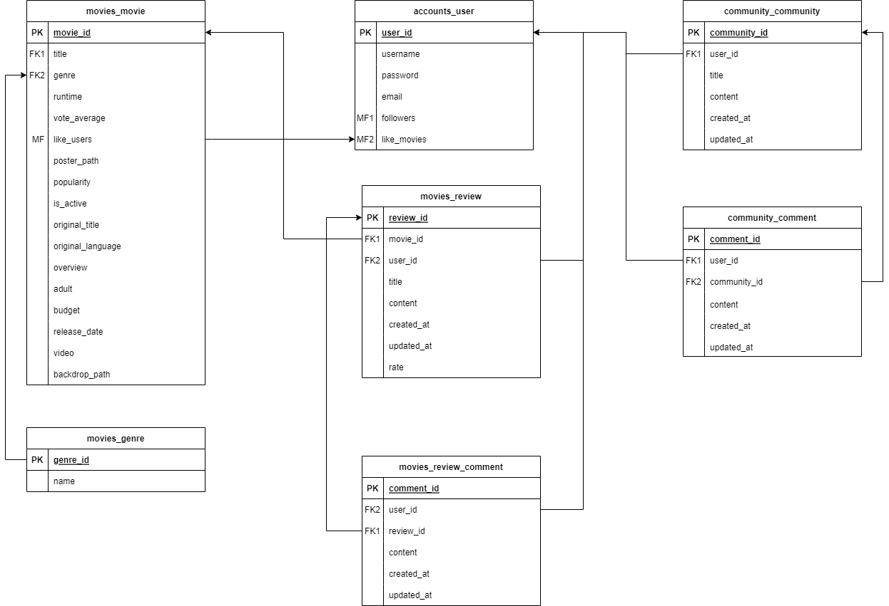
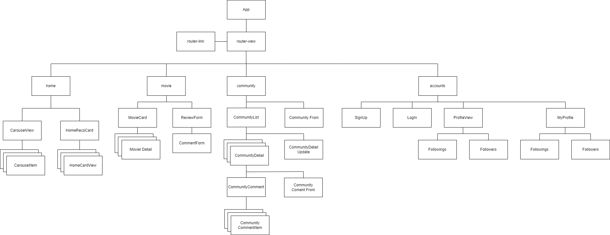

# 🎬Sneeze🎬
- 영화 추천 프로젝트
- SSAFY 8th 관통 프로젝트
- 프로젝트 기간 : `2022.11.16` ~ `2022.11.25`

 

# :book: Contents :book:
[:one: 팀원 정보](#one-팀원-정보) 
[:two: 목표 서비스 구현 및 실제 구현 정도](#two-목표-서비스-구현-및-실제-구현-정도) 
[:three: 데이터베이스 모델링](#three-데이터베이스-모델링) 
[:four: 영화 추천 알고리즘](#four-영화-추천-알고리즘) 
[:five: 기능 설명](#five-기능-설명) 
[:six: 느낀 점](#six-느낀-점) 

 

## :one: 팀원 정보

### 1.1. 서재건

> 백엔드

- accounts(userinfo), community, movies 등 CRUD 구현
  
   알고리즘 : 유저의 좋아요, 리뷰 기반 장르 비교를 통해 영화 추천

>  프론트

- MovieDetail 
  
  서버와의 데이터 교류, youtube api를 통해 youtube video 받기
  
  tmdb api를 통한 recommendation, similar movie 데이터 받기
  
  하위 컴포넌트 간 연결

- Community(, Comment), Review(, Comment) 서버와의 연결 통한 데이터 통신 및 관련 하위 컴포넌트 연결, 프로필 컴포넌트 연결
  
  - file 컴포넌트에서 사용자 및 유저 데이터 가져오기
  
  - Card 컴포넌트로 swiper 구현

### 1.2. 이채은

> 백엔드

- Accounts(accounts)
  
  dj_rest_auth를 사용한 login, signup 구현

> 프론트엔드

- Accounts
  
  유저 Profile 구성

- HomeView
  
  Vue router를 활용한 nav 바 구성
  
  Carousel을 통

- CSS
  
  CSS 전반 및 홈페이지 디자인

 

## :two: 목표 서비스 구현 및 실제 구현 정도

### 2.1. 목표 서비스

1. 영화 상세 조회

   - 검색 기능
   - 관련 youtube영상 출력
   - 좋아요 및 리뷰 기능

2. 영화 추천 서비스

   - 코사인 유사도 활용한 추천
3. Review
   - 각 영화마다 리뷰 생성 및 댓글 기능

4. Community, Comment

   - 자유게시판 운영 및 수정, 삭제 기능

5. Profile

   - 각 유저에 대한 profile 생성

### 2.2. 실제 구현 정도

1. 영화 조회

	- 영화 검색 및 검색에 따른 즉각적 영화 조회    
	
	- 상세 페이지 내 Tabs를 활용한 향상된 UX 제공
	- Youtube 영상, 관련 추천 영화, 관련 영화 제공
	
2. 영화 추천 서비스

    - 영화 추천

       - 유저의 좋아요 기반 추천
       - 현재 인기 영화 추천
       - 높은 평점을 받은 영화 추천
       - 짧은 러닝타임 영화 추천
       - 모든 유저들의 리뷰 기반 영화 추천

3. Review

    - 각 영화마다 리뷰 생성 및 댓글 기능

       기능

4. Community, Comment

    - 자유게시판 운영

      및 수정, 삭제 기능

5. Profile

    - 각 유저의 프로필 페이지
    - 팔로워 기능
    - 프로필 페이지 내에 팔로우 수, 팔로워 수, 좋아요한 영화 수 제공
    - 좋아요한 영화와 리뷰한 영화 제공

 

## :three: 데이터베이스 모델링

### 3.1. Model

### 3.2 Components

 

## :four: 영화 추천 알고리즘

총 5가지의 영화 데이터를 출력

### 4.1. 취향저격 베스트 콘텐츠

1. 사용자(request.user)를 찾아서 역참조를 통해 사용자가 좋아요 한 모든 영화들을 찾습니다.

2. 해당 영화들에 반복문을 돌려서 각 영화의 장르 데이터를 잡아 my_genres라는 dictionary에 담습니다.

3. value값이 가장 높은 상위 3개의 장르들을 선정하고 모든 영화들 중에서 해당 3개의 장르가 있는 영화들을 set에 담습니다.

4. list로 변환하여 popularity를 기준으로 sort한 다음 30개의 영화를 선정합니다.

### 4.2. 현재 인기 영화

- Movie.objects.order_by('-popularity')[:30] : order_by 활용

### 4.3. 높은 평점을 받은 영화

- Movie.objects.all().order_by('-vote_average')[:30] : order_by 활용

### 4.4. 짧은 러닝타임, 가볍게 볼 수 있는 영화

- Movie.objects.all().order_by('runtime')[:30] : order_by 활용

### 4.5. 모든(SNEEZE) 유저들이 많이 리뷰한 영화

모든 유저들이 리뷰한 영화들 중 사용자가 좋아요 한 영화를 제외하여 users_movies에 담습니다.

만약 30개가 채워지지 않는다면 최다 평점 수 영화들로 부족한 갯수를 채워 넣어 30개의 영화를 선정합니다.

그리고 리뷰한 영화가 하나도 없다면 최다 평점 수 영화 30개를 선정합니다.

 

## :five: 기능 설명

| 기능               | 기능 설명                                                               |
| ---------------- | ------------------------------------------------------------------- |
| 회원가입, 로그인        | DRF의 authtoken을 사용한 인증 기능                                           |
| 로그아웃             | authtoken 정보 삭제 기능                                                  |
| 유저 팔로우           | 유저간 팔로우 및 언팔로우 기능, 모달을 통해 팔로워 및 팔로잉 유저 정보 제공                        |
| 유저 프로필           | 리뷰, 좋아요, 팔로우에 관한 유저 정보 제공                                           |
| 유저 권한            | 로그인 여부에 따른 유저의 접근 권한 제한                                             |
| nav바             | 비동기 방식을 사용한 기능 제공                                                   |
| 영화 메인 페이지        | DB에 포함된 전체 영화 리스트를 pagination과 함께 제공                                |
| 영화 검색            | 검색창에 입력된 한국어 키워드를 포함한 영화 리스트 제공                                     |
| 영화 디테일 페이지       | 포스터, 평점, 줄거리, 관련 영상, 추천영화, 리뷰 등 영화 정보 제공                            |
| 영화 좋아요           | 좋아요 추가 및 삭제 기능, DB에 저장해 알고리즘 및 프로필에 활용                              |
| 영화 리뷰 및 댓글       | 영화 디테일 창에서 해당 영화에 대한 리뷰 및 평점 추가 기능, 각 리뷰에 대한 댓글 기능 구현               |
| 영화 리뷰 및 댓글 수정·삭제 | 폼을 활용한 리뷰 수정, 화면 변환 없는 댓글 수정                                        |
| 게시판 메인 페이지       | 전체 게시글에 대한 제목, 작성자, 작성일 정보를 리스트로 제공                                 |
| 게시판 디테일 및 댓글     | 게시글 내용을 포함한 디테일 정보 제공, 각 게시글에 대한 댓글 기능 구현                           |
| 게시글 및 댓글 수정·삭제   | 폼을 활용한 게시글 수정, 화면 변환 없는 댓글 수정                                       |
| 홈 화면             | 인기도가 높은 영화를 carousel로 제공, 추천 알고리즘 네가지를 swiper로 제공                   |
| admin            | Django Admin을 사용하여 movie, community, account에 대한 정보 제어할 수 있도록 기능 구현 |
| 404 페이지          | 없는 URL로 요청시 404 페이지로 이동                                             |

### 5.1. 기본에 충실한 기능

리뷰 및 게시글 작성·수정·삭제가 매우 매끄럽게 진행되며, 댓글도 별도의 화면 이동 없이 원하는 게시글 아래에서 작성·수정·삭제가 가능해 막힘없는 사용자 경험을 제공합니다. 화려한 효과 없이 깔끔한 인터페이스로 사용자가 콘텐츠에 집중할 수 있습니다.

### 5.2. 검색

검색창에 글자가 입력될 때마다 즉각적으로 검색 결과가 변화하며 영화 리스트를 제공합니다. 검색 결과 검색은 한국어만 지원됩니다.

### 5.3. 소통

영화 디테일 페이지 바로 아래에 관련 리뷰를 열람 및 추가할 수 있는 기능을 구현하여 비슷한 관심사를 가진 사용자들의 소통을 장려하고 있습니다. 게시판 뿐만 아니라 리뷰에 대한 댓글 서비스도 제공하고 있으며, 이는 해당 영화에 대한 다양한 의견 개진과 비판적인 평론 문화를 조성합니다. 게시판에서는 단일 영화에 국한되지 않고 영화에 대한  사용자간의 자유로운 의사소통이 가능합니다. 리뷰와 게시판 페이지 모두에서 게시글 및 댓글 작성자의 활동 내역을 바로 확인할 수 있으며 팔로우도 할 수 있습니다.

 

## :six: 느낀 점

### 6.1. 서재건

이번 프로젝트로 한 학기 동안 배운 것을 활용하여 하나의 완성된 사이트를 만들었고 이 과정을 통해 백엔드 및 프론트엔드의 기반을 다질 수 있었습니다.

> 백엔드

- 백엔드 부분에서 dj_rest_auth를 제외한 **모든 부분을 구현**하였는데 한 학기 동안 <u>복습 및 수업에 성실히</u> 임하여서 큰 어려움 없이 **기본 CRUD 및 Rest API**를 통한 통신을 구현할 수 있었습니다. 추가적으로 <u>1일 1알고리즘</u> 문제를 꾸준히 풀면서 알고리즘 역량을 키워 **추천 알고리즘도 구현**하였습니다.
또한, **페이징 기능**이 필요하다고 판단하고 <u>직접 찾아서 학습</u>하여 프로젝트에 적용해보았습니다. 이 과정을 통해 **CRUD와 Rest API 설계에 대한 기반**을 다질 수 있었습니다.  
- 그리고 구현하면서 변수에 값이 들어있지 않은 오류나 이로 인해 내부 동작 중 Error가 발생했을 때 **print()를 적재적소에 사용**하여 어떤 변수에 데이터 오류가 있는지 또는 어떤 부분에서 **Error를 발생시키는지 빠르고 명확하게 확인**할 수 있었고 이 부분을 같은 반 동료들과 공유하고 도와주면서 동료들의 코드 내부 동작에 대한 이해를 빨리 할 수 있었으며 이를 통해 동료의 Error들도 빠르게 잡을 수 있었습니다.

> 프론트엔드

- 개인적으로 디자인 측면에서 부족함이 있어 **서버, 외부 API 와의 데이터 통신 및 컴포넌트 연결에 집중**하였습니다.

- vue2를 통해 SPA 구현을 하면서 **동일 컴포넌트를 연속적으로 페이지 렌더링 하지 못하는 오류**가 있었습니다.
  - 바로 특정 영화에 대한 상세 페이지에서 관련 영화들의 포스터를 클릭하면 다시 그 영화 상세 페이지로 이동하도록 구현하고자 했으나 해당 컴포넌트에서 다시 같은 컴포넌트로 렌더링하지 못하는 문제가 발생하였고 이것에 대해 해결 방법을 고민하다가 **영화 검색 페이지에 클릭한 영화의 제목을 입력한 상태로 페이지 렌더링을 하여 우회하는 방식으로 해당 문제를 해결**하였습니다.
  - 이 과정에서 영화 데이터를 불러와서 렌더링하는 속도와 검색창에 제목을 입력한 상태로 **렌더링하는 속도에 차이가 발생**하여 검색창이 입력값이 없는 상태로 렌더링되어 **해당 방법(우회하는 방식)이 적용이 안되는 것으로 보여졌으나** <u>console에 log를 작성하면서 확인</u>하여 데이터 통신과 흐름을 파악하였고 속도 차이로 인해 발생한 문제인 것을 파악하여 **동기 처리**를 통해 해당 방법을 적용시켜 해결하였습니다.

 

- 또한, 페이지 렌더링하는 **흐름에 대한 이해**로 데이터 통신에서 **비동기, 동기 처리**를 하여 웹 페이지 렌더링 시 c**onsole 창에 보여지는 Error들을 모두 정리**하였습니다.

- swiper라는 기능을 사용함에 있어 **설정에 따른 오류**가 계속적으로 발생하였고 해당 부분을 해결하기 위해 검색을 통해 찾아보고 다른 것을 적용해보고 하였지만 진척없이 시간이 지체되어 팀원에게 해당 문제를 공유하였고 같은 반 동료들에게도 **공유함으로서 적합한 설정 방식을 찾아서 적용**하였습니다.

---

### 6.2. 이채은

지난 5개월 동안 배운 모든 것들을 총망라하는 프로젝트 기간이었습니다. 개별적으로 기능하는 것 같던 프론트엔드와 백엔드를 직접 연동해보면서 Django와 Vue.js에 대한 이해를 높일 수 있었습니다. 필요한 정보를 불러오기 위해 axiox를 사용할 때 백엔드에 적절한 url과 함수를 만들어주면서 serializer를 효율적으로 활용하는 방법을 배웠습니다. 다양한 인증 시스템을 활용한 다른 프로젝트를 레퍼런스로 활용하며 각 프로젝트에 알맞는 기술을 적용할 필요가 있다는 것을 몸소 체험했습니다.

또한, 개발자 입장에서도 프로젝트의 원활한 진행을 위해서는 기획 및 계획이 기능 구현만큼 중요하다고 생각하게 되었습니다. 자잘하고 많은 기능을 구현하다 보면 디테일한 부분은 잊어버리거나 변경사항을 제대로 반영하지 못하는 경우가 생기는데 사전에 필요한 부분을 정리해두고 우선순위를 정해서 계획을 세운다면 이러한 실수를 줄일 수 있을 것 같습니다. 특히 모델이나 컴포넌트는 웹 사이트 실행시 매우 기초적인 오류를 발생시킬 수 있으므로 최대한 변화를 줄이는 것이 바람직하다고 생각되는데 이 또한 꼼꼼한 기획을 통해 개선할 수 있을 것 입니다.

마지막으로, 원활한 소통이 프로젝트의 완성도와 직결된다는 것을 알 수 있었습니다. 노션 등의 툴을 사용한 세세하고 잦은 의견 교환을 통해 여러 오류과 시간 낭비를 막을 수 있을 것 같습니다.
